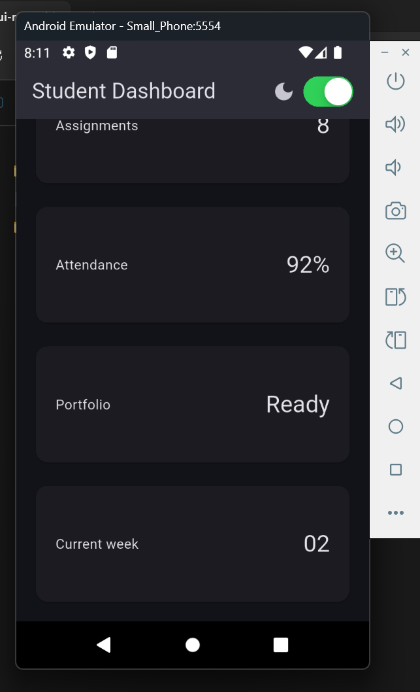
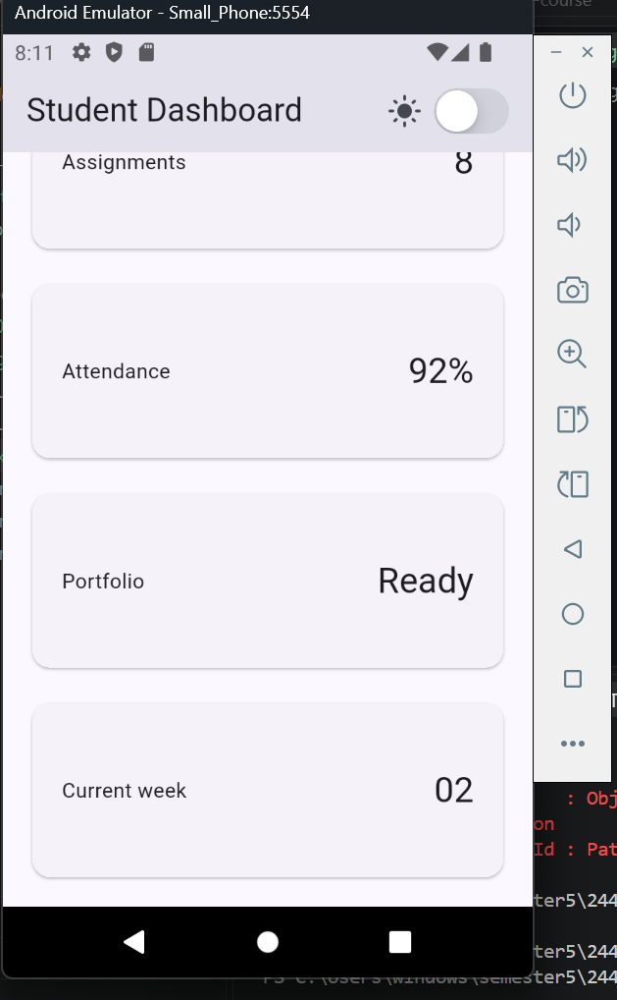
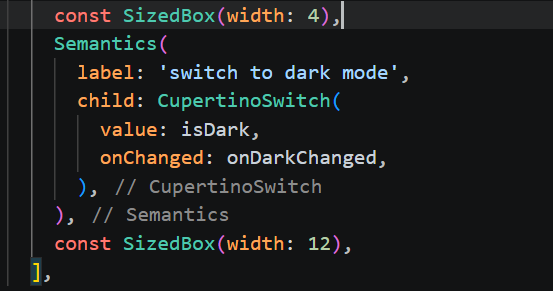
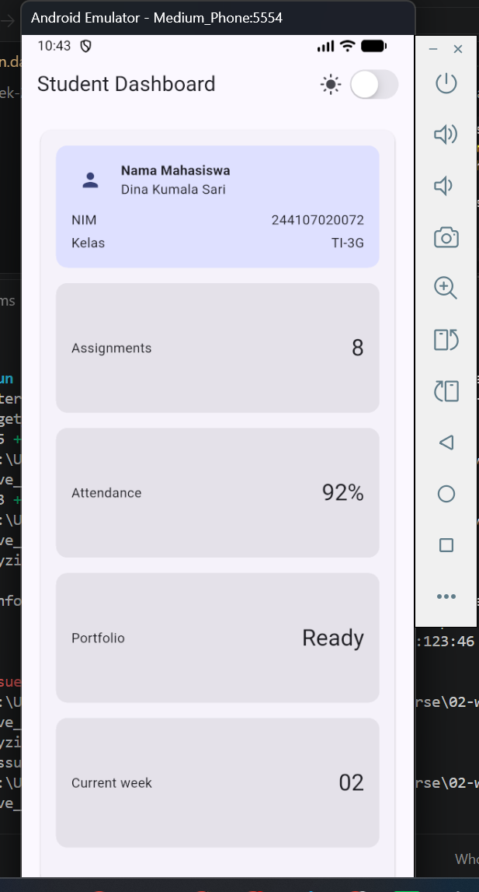
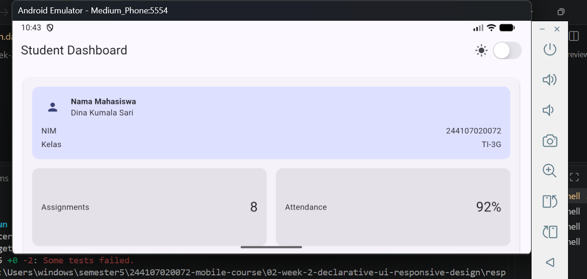
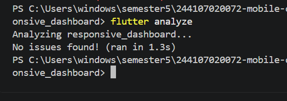
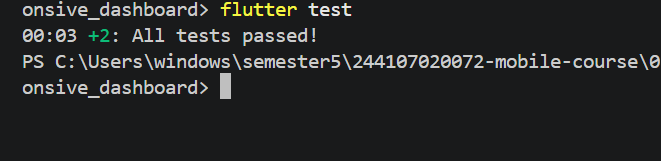

Apa perbedaan cara berpikir imperative dan declarative saat membangun UI?
jawab: bedanya yang imperative itu bagaimana sedangkan declarative itu apa

Kapan Expanded membantu dan kapan penggunaannya justru menghasilkan layout error?
jawab: Saat digunakan di dalam anak langsung dari Row, Column, atau Flex untuk mengisi sisa ruang kosong secara proporsional atau mencegah unbounded width/height overflow.

Bagaimana breakpoint dan theme memengaruhi pengalaman pengguna?
jawab: 1. Memastikan tata letak aplikasi beradaptasi dengan ukuran layar perangkat 2. Meningkatkan kenyamanan visual pengguna

Apa yang Anda verifikasi dari rekomendasi AI setelah tugas inti selesai?
jawab: Memastikan kode dari AI benar-benar berjalan, lolos kriteria unit test/widget test, dan tidak memicu bug atau error tersembunyi

hasil percobaan warm-up eksperimen

praktikum 1

Tugas utama

Hasil test:

