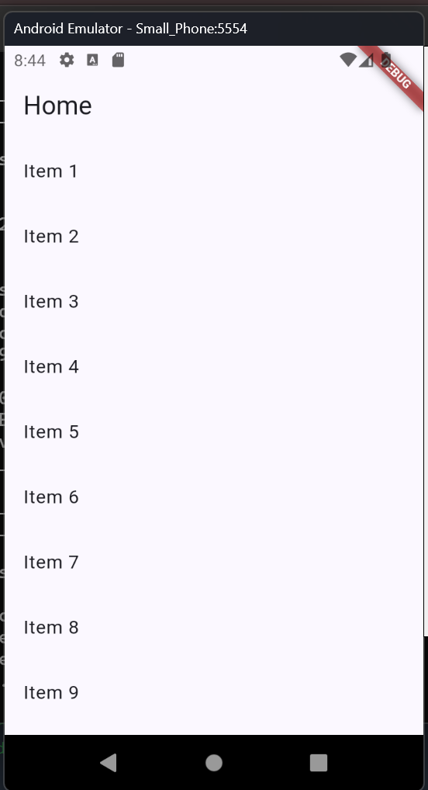
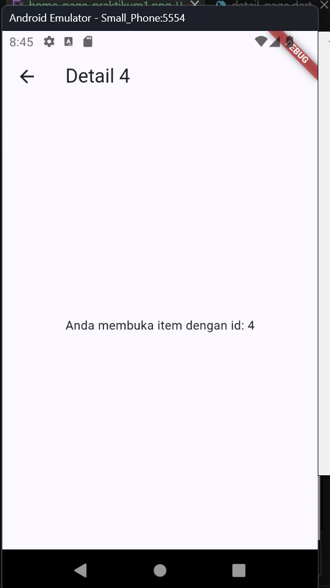
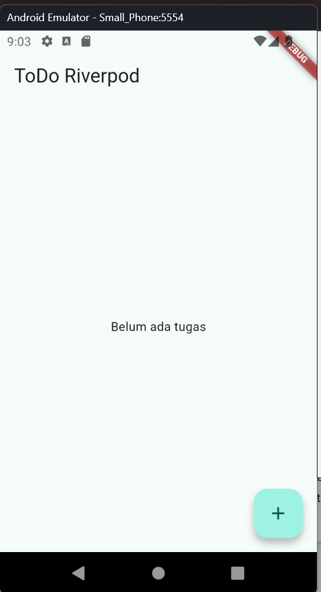
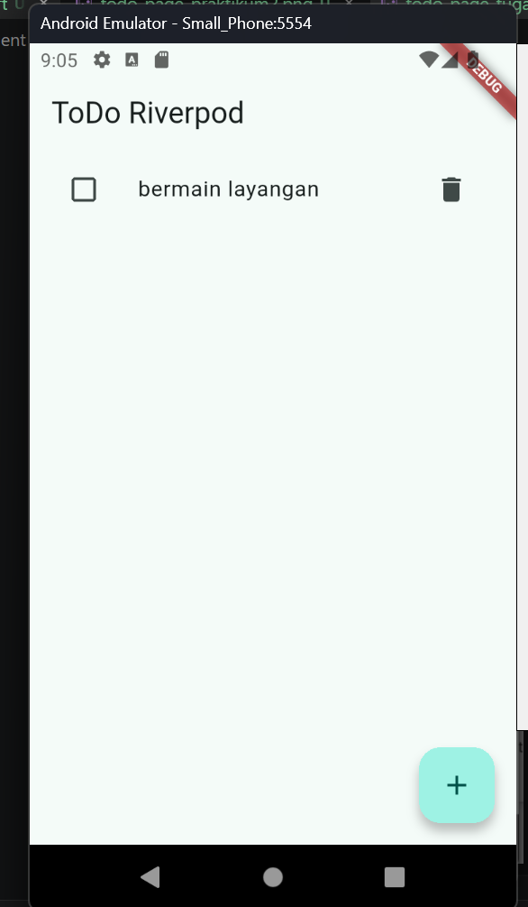
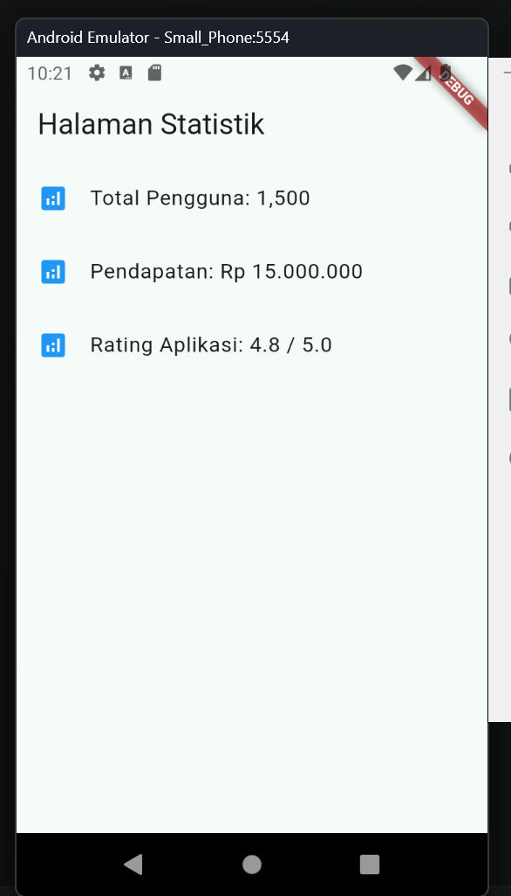
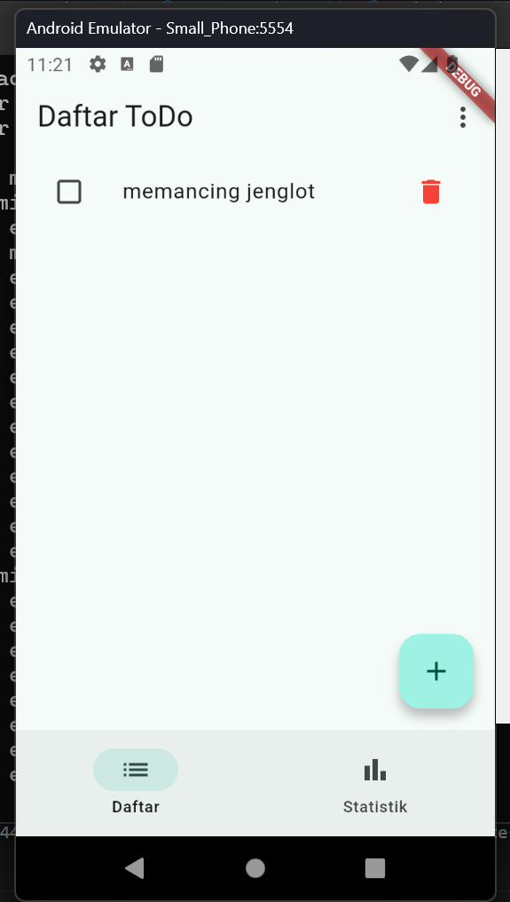
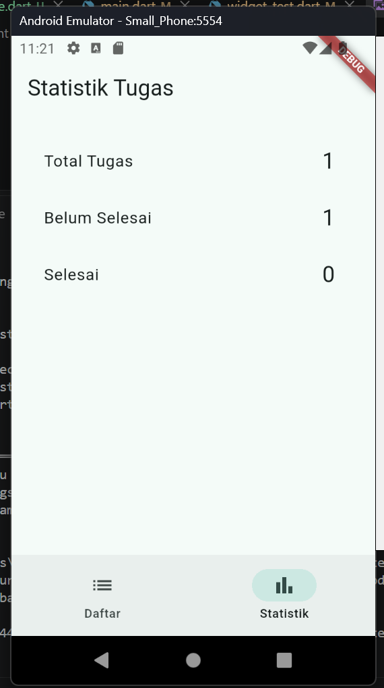
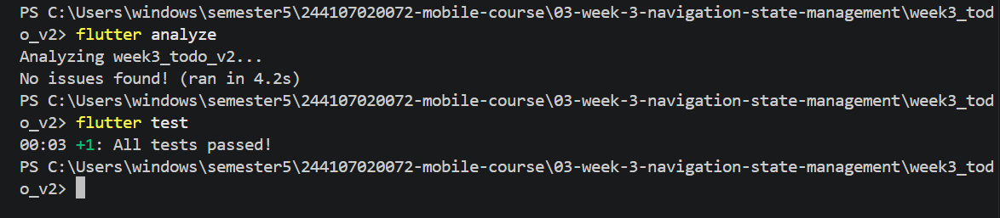

# Refleksi
Kapan setState masih cukup, dan kapan state harus naik ke Riverpod?  
Jawab:  
setState: Cukup digunakan untuk state lokal yang hanya memengaruhi satu widget.  
Riverpod: Dibutuhkan ketika state harus diakses atau dibagikan ke banyak widget di halaman berbeda, atau ketika state harus bertahan meskipun navigasi berpindah halaman.  
Apa perbedaan context.go dan context.push, dan kapan masing-masing tepat digunakan?  
jawab:  
context.go: Melakukan navigasi absolut dengan mengganti history tumpukan rute saat ini. 
context.push: Menambahkan rute baru ke atas tumpukan tanpa menghapus rute sebelumnya, sehingga tombol back otomatis muncul.  

Bagaimana AsyncValue mencegah bug dibanding tiga boolean terpisah? 
Jawab:  
AsyncValue menggabungkan status loading, error, dan data ke dalam satu objek tertutup (sealed class). Ini mencegah bug logika di mana pengembang lupa mengubah salah satu status (misalnya, isLoading bernilai false tapi error terisi data basi), sehingga UI dijamin sinkron dengan kondisi asinkron yang sedang terjadi.  

Bagian mana dari hasil AI yang Anda perbaiki, dan mengapa? 
jawab:  
Sudah oke.  

## Praktikum 3
1. mengapa menampilkan ulang data lama (stale data) dengan indikator refresh kadang lebih baik daripada mengosongkan layar? Kapan pola itu penting?  
jawab:  
Agar aplikasinya nggak keliatan nge-bug saat lagi loading data baru. Jika layar tiba-tiba putih atau kosong, user bakal mikir aplikasinya error. Jadi, data lama tetep dipajang biar user masih bisa lihat, sambil nunggu data barunya selesai ditarik dari server.  
Pola itu penting pas aplikasi lagi ambil data dari internet yang butuh waktu, jadi user nggak capek menunggu layar kosong.  

# AI CHALLENGE
Apakah state diubah secara immutable (tidak ada state.add() atau mutasi list langsung)?  
jawab:  
Kode tidak pernah menggunakan state.add() atau mengubah isi List secara langsung. Nilai dikembalikan (return) sebagai data/List baru secara langsung dari method build() milik AsyncNotifier. Riverpod secara internal menangani pembuatan objek AsyncValue.data baru tanpa memutasi state lama  
Apakah ref.watch hanya dipakai di dalam build, dan ref.read di callback?  
jawab:  
Pada StatsPage, ref.watch(statsProvider) dipanggil khusus di dalam fungsi build(). Sementara itu, untuk pemicu aksi di dalam callback tombol (onPressed), digunakan ref.invalidate(statsProvider) tanpa menggunakan ref.watch. 
Apakah ketiga state AsyncValue benar-benar ditangani (bukan hanya success)?  
jawab:  
Penggunaan method statsAsync.when(...) secara eksplisit menangani ketiga kondisi utama tanpa ada yang terlewat.  
Apakah provider dideklarasikan dengan tipe eksplisit dan tidak duplikat dengan provider lain?  
Jawab:  
Provider dideklarasikan dengan tipe generik yang sangat jelas dan eksplisit.  "final statsProvider = AsyncNotifierProvider<StatsNotifier, List<String>>(() { ... });"   Tidak ada tipe data yang tersembunyi (dynamic) dan tidak ada duplikasi variabel provider.  
Apakah kode AI memakai API Riverpod versi lama (StateProvider antipattern, StateNotifierProvider usang, atau Consumer bertingkat yang tidak perlu)? Perbaiki ke pola Notifier/ConsumerWidget.  
jawab:  
Kode sepenuhnya menggunakan Riverpod 2.x+ / 3.x Modern API:  
Menggunakan AsyncNotifier & AsyncNotifierProvider (Bukan StateNotifierProvider atau FutureProvider lama).  
Menghindari penggunaan StateProvider yang tergolong anti-pattern untuk complex state.
Menggunakan struktur ConsumerWidget bersih tanpa menyisipkan widget Consumer bertingkat yang tidak diperlukan.  
Jalankan flutter analyze dan flutter test, apakah hasil AI lolos tanpa warning?  
jawab:  
Iya, flutter analyze dan flutter test nya lulus tanpa warning.  

# Hasil IMAGE
### Praktikum 1
  
  

### Praktikum 2
  
  

### Praktikum 3
  
  
  

### AI CHALLENGE
  
  

### Tugas Refactoring
  
  
  