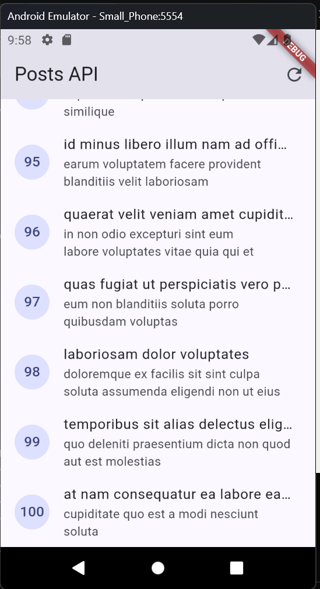
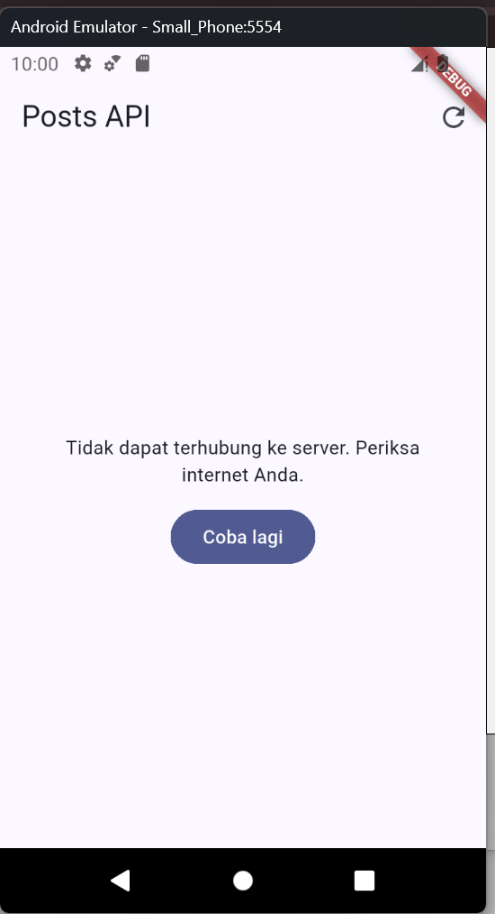
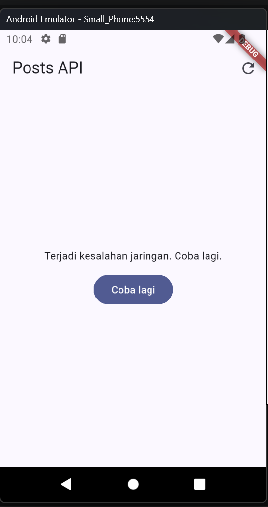
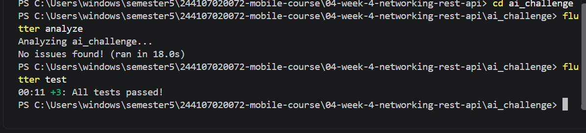
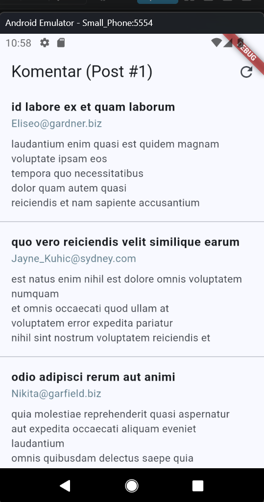
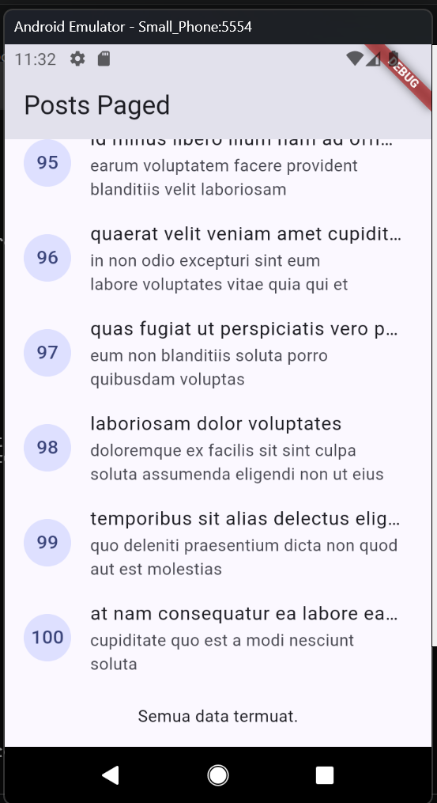
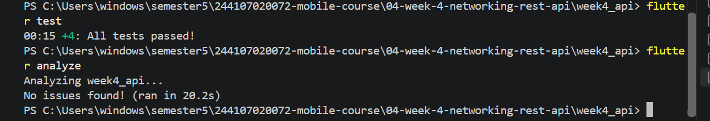

# Praktikum 2
# Uji tiga skenario error
1.Jalankan aplikasi dengan internet normal, amati loading lalu daftar 100 posts. 
jawab: 
  
2.Matikan internet (mode pesawat), tekan refresh, amati pesan ramah + tombol Coba lagi. Nyalakan kembali internet, tekan Coba lagi. 
jawab: 
  
3.Sementara ubah baseUrl menjadi URL salah, amati pesan error koneksi. Kembalikan setelah uji. 
jawab:  
   

# Praktikum 3

# Hasil Ai challenge
Semua verifikasi sudah sukses dilakukan, hasil test juga lulus
   
   

# Hasil Refactoring
   
  