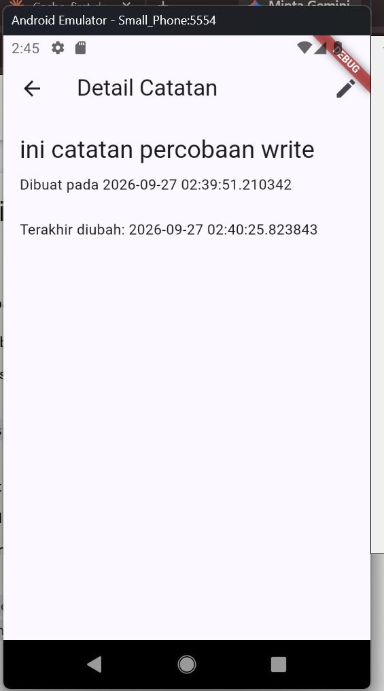
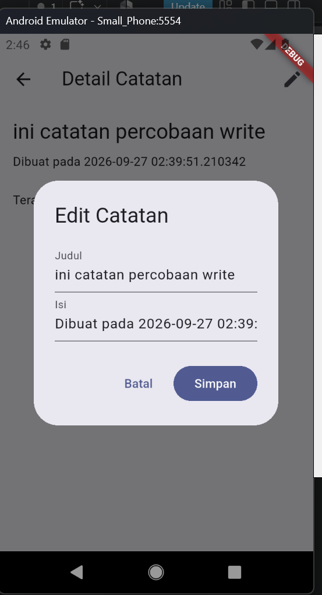
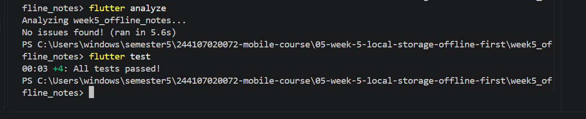

# Praktikum 1 Praktikum 2 dan Praktikum 3
Hasil dari ketiga praktikum, sebelum wifi dihidupkan:   
  
Hasil dari ketiga praktikum sesudah wifi dihidupkan   
  

## Observasi
saat wifi dimatikan, notes berada dalam mode offline. pengguna dapat melihat note sebelumnya karena tersimpan di dalam cache. lalu saat buat note baru akan masuk ke dalam dirty cache. setelah async, maka note akan masuk ke dalam data cache yang baru jg.

# ai_challenge

Apakah AI menempatkan daftar catatan di SharedPreferences? (menolak: rapuh untuk koleksi).
jawab: iya
Apakah skema AI mendukung antrean sync (dirty flag / updated_at) atau hanya CRUD polos?
jawab: masih CRUD polos
Apakah klaim "real-time" AI didukung stream (Drift/watch) atau hanya asumsi?
jawab: iya, valid.
Apakah estimasi boilerplate AI masuk akal setelah Anda mencoba instalasinya (flutter pub add + migrasi skema)?
jawab: akurat
Keputusan final Anda beserta alasannya, boleh berbeda dari rekomendasi AI selama berargumen.
jawab: saya lebih memilih SharedPreferences karna lebih mudah, ringan, cepat. Rasanya lebih efisien karna semua key value nya ada di satu file.

# table perbandingan
  
# grafik perbandingan solusi
  
   

# Hasil tugas refactoring
mode offline sebelum async 
  
mode online setelah async  
  
hasil test dan analyze sukses 
 

# hasil tugas akhir
mode offline sebelum async 
 
mode online setelah async 
 
menghapus catatan yang mau di delete 
 
melihat/membaca note 
 
membuat/menulis/edit notes  
 
hasil test dan analyze sukses 

# rekleksi
Mengapa daftar catatan tidak boleh disimpan di SharedPreferences? Apa yang rusak jika aturan ini dilanggar? 
jawab:  SharedPreferences cocok untuk data kecil, seperti satu nilai saja, contohnya dark mode. Kalau daftar catatan yang banyak dan terus bertambah disimpan di situ, semua catatan harus dijadikan satu teks besar, lalu tiap ada perubahan kecil, teks itu dibaca ulang dan ditulis ulang semuanya. Jadi lambat kalau catatan sudah banyak. Kalau prosesnya terhenti di tengah jalan, semua catatan bisa rusak sekaligus, bukan cuma satu. SQLite lebih cocok karena bisa simpan per baris, jadi lebih aman dan lebih cepat dicari.  

Kapan cache-first cukup, dan kapan Anda membutuhkan strategi lain (misalnya network-first untuk data harga real-time)? 
jawab:  Cache-first cukup untuk data yang tidak harus selalu baru, seperti daftar post. Jadi walau tidak ada koneksi, tetap bisa tampil. Tapi untuk data yang berubah cepat, seperti harga saham, cache-first bisa bikin data yang ditampilkan sudah lama tapi user tidak sadar. Untuk kasus itu, lebih baik pakai network-first, coba ambil dari server dulu, cache cuma jadi cadangan kalau memang tidak ada koneksi.  

Bagaimana dirty flag berubah menjadi antrean sync tanpa memblokir UI? Kapan antrean terpisah (tabel outbox) menjadi perlu? 
jawab:  Saat wifi dimatikan, notes berada dalam mode offline. Pengguna tetap bisa melihat note sebelumnya karena tersimpan di cache. Saat buat note baru, note itu langsung masuk ke database lokal dan ditandai dirty, lalu langsung tampil di UI tanpa nunggu proses ke server. Baru saat tombol sync ditekan, aplikasi cari semua note yang dirty, kirim ke server, dan setelah proses itu selesai (async), note ditandai tidak dirty lagi. 

Tabel outbox terpisah baru dibutuhkan kalau urusannya lebih rumit, misalnya perlu simpan urutan tiap perubahan, atau satu note bisa punya beberapa perubahan yang harus dikirim satu-satu.  

Bagian mana dari rekomendasi AI yang Anda tolak, dan mengapa? 
jawab:  Saya sempat mau taruh logika sync langsung di halaman UI supaya cepat selesai. Tapi saya gak jadi, karena nanti susah dites dan dipakai ulang. Jadi logika cache dan sync saya pindah ke file terpisah, biar halaman UI cuma fokus tampilkan data saja.