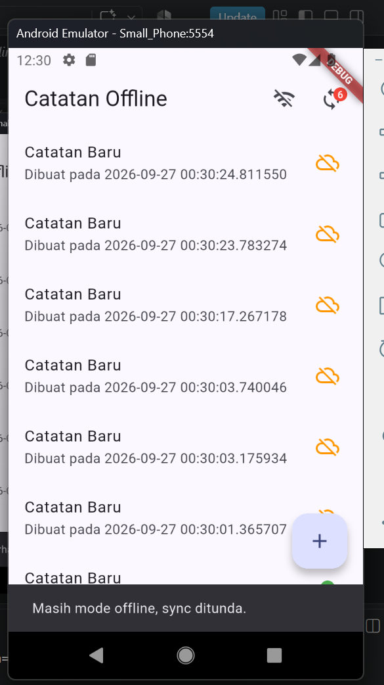
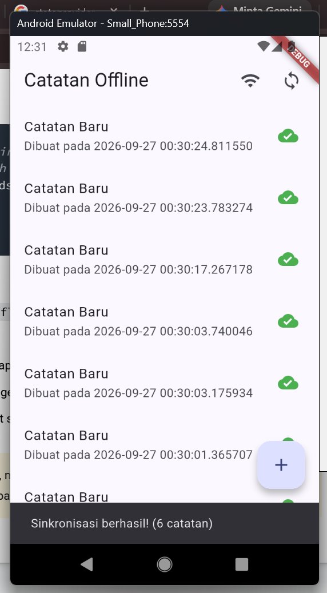
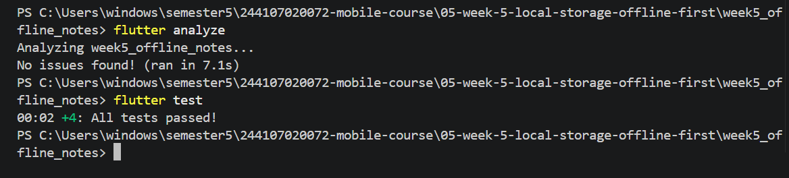

# Praktikum 1 Praktikum 2 dan Praktikum 3
Hasil dari ketiga praktikum, sebelum wifi dihidupkan:   
  
Hasil dari ketiga praktikum sesudah wifi dihidupkan   
  

## Observasi
saat wifi dimatikan, notes berada dalam mode offline. pengguna dapat melihat note sebelumnya karena tersimpan di dalam cache. lalu saat buat note baru akan masuk ke dalam dirty cache. setelah async, maka note akan masuk ke dalam data cache yang baru jg.

# ai_challenge

Apakah AI menempatkan daftar catatan di SharedPreferences? (menolak: rapuh untuk koleksi).
jawab: iya
Apakah skema AI mendukung antrean sync (dirty flag / updated_at) atau hanya CRUD polos?
jawab: masih CRUD polos
Apakah klaim "real-time" AI didukung stream (Drift/watch) atau hanya asumsi?
jawab: iya, valid.
Apakah estimasi boilerplate AI masuk akal setelah Anda mencoba instalasinya (flutter pub add + migrasi skema)?
jawab: akurat
Keputusan final Anda beserta alasannya, boleh berbeda dari rekomendasi AI selama berargumen.
jawab: Aku lebih memilih SharedPreferences karna lebih mudah, ringan, cepat. Rasanya lebih efisien karna semua key value nya ada di satu file.

# table perbandingan
  
# grafik perbandingan solusi
  
   

# Hasil tugas refactoring
mode offline sebelum async 
  
mode online setelah async  
  
hasil test dan analyze 
 