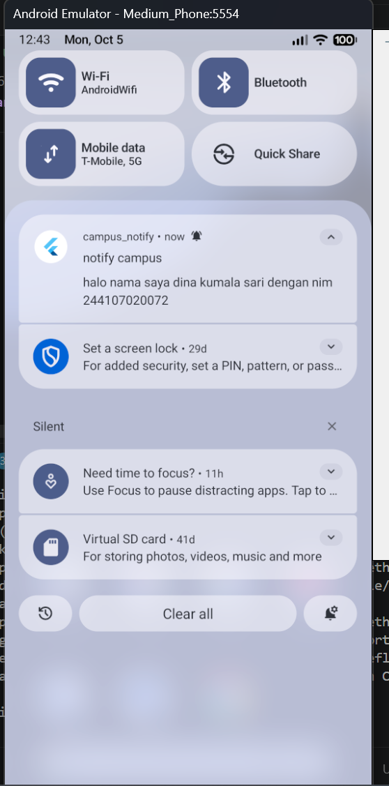
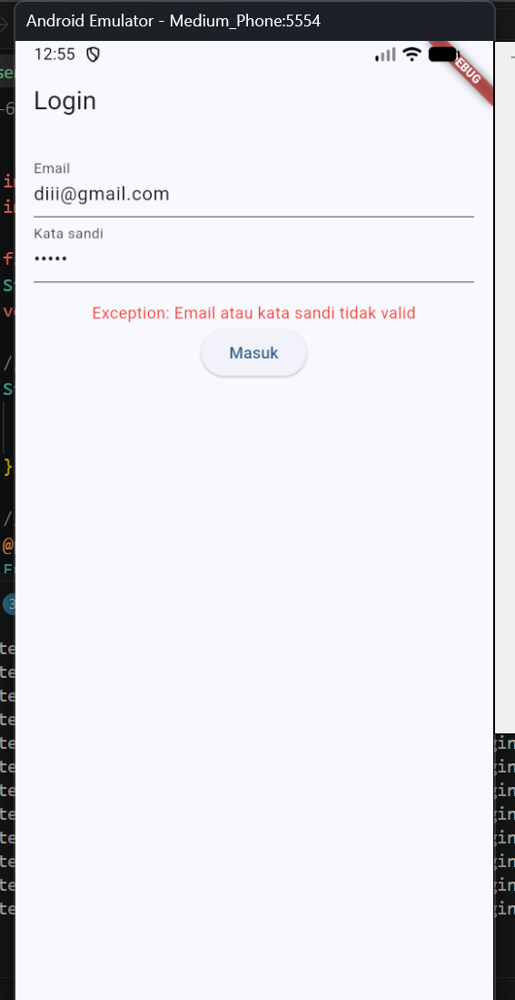
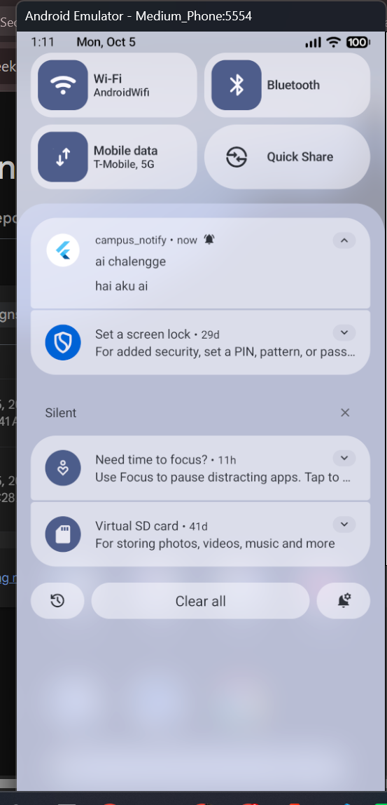
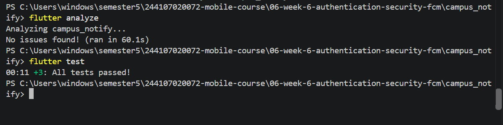

# Hasil praktikum

# Ai Challenge jawaban
Apakah background handler berupa fungsi top-level dengan @pragma('vm:entry-point')? (tolak jika berupa method kelas). 
jawab: sudah bagus
Apakah onTokenRefresh benar-benar mengirim token baru ke backend, bukan hanya dicetak ke log? 
jawab: sudah bagus juga
Apakah foreground memakai local notification manual? (tanpa ini banner tidak muncul saat aplikasi terbuka). 
jawab: sudah benar, ada banner nya
Apakah klik dari ketiga state (foreground/background/terminated) masuk ke rute yang benar? Buktikan dengan tabel pengujian.
jawab: saat saya klik banner nya, hanya menuju ke beranda untuk login
Apakah token/secret tidak di-hardcode dan tidak di-log penuh? Perbaiki bila AI melanggarnya. 
jawab: sudah bagus, ia tidak melanggarnya.
Keputusan final dan alasan teknis Anda, boleh berbeda dari saran AI selama berargumen. 
jawab: saya putuskan untuk memakai kode awal saja.

## hasil ai challenge
 

# hasil refactoring
 
 

# refleksi
Mengapa refresh token tidak boleh disimpan di SharedPreferences? Apa risikonya bila bocor? 

Apa yang rusak bila onTokenRefresh diabaikan selama satu semester perkuliahan? 

Kapan memakai topik dan kapan memakai token perangkat? Beri contoh pesan kampus untuk masing-masing. 

Bagian mana dari draf AI yang Anda tolak atau perbaiki, dan mengapa? 