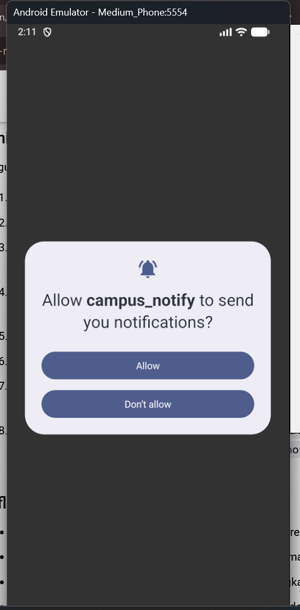
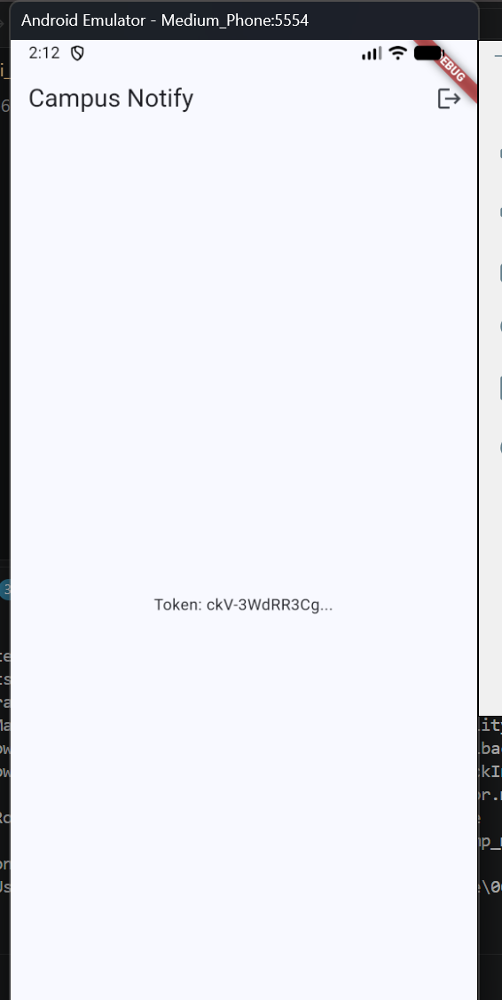

# Hasil praktikum

# Ai Challenge jawaban
Apakah background handler berupa fungsi top-level dengan @pragma('vm:entry-point')? (tolak jika berupa method kelas). 
jawab: sudah bagus
Apakah onTokenRefresh benar-benar mengirim token baru ke backend, bukan hanya dicetak ke log? 
jawab: sudah bagus juga
Apakah foreground memakai local notification manual? (tanpa ini banner tidak muncul saat aplikasi terbuka). 
jawab: sudah benar, ada banner nya
Apakah klik dari ketiga state (foreground/background/terminated) masuk ke rute yang benar? Buktikan dengan tabel pengujian.
jawab: saat saya klik banner nya, hanya menuju ke beranda untuk login
Apakah token/secret tidak di-hardcode dan tidak di-log penuh? Perbaiki bila AI melanggarnya. 
jawab: sudah bagus, ia tidak melanggarnya.
Keputusan final dan alasan teknis Anda, boleh berbeda dari saran AI selama berargumen. 
jawab: saya putuskan untuk memakai kode awal saja.

## hasil ai challenge
 

# hasil refactoring
 
 

# refleksi
Mengapa refresh token tidak boleh disimpan di SharedPreferences? Apa risikonya bila bocor? 

Apa yang rusak bila onTokenRefresh diabaikan selama satu semester perkuliahan? 

Kapan memakai topik dan kapan memakai token perangkat? Beri contoh pesan kampus untuk masing-masing. 

Bagian mana dari draf AI yang Anda tolak atau perbaiki, dan mengapa? 

# tugas akhir
 
  
 

# refleksi
Mengapa refresh token tidak boleh disimpan di SharedPreferences? Apa risikonya bila bocor? 
SharedPreferences menyimpan data sebagai teks biasa (file XML di Android, plist di iOS) tanpa enkripsi. Pada perangkat yang di-root atau di-jailbreak, lewat backup yang tidak aman, atau malware, file itu bisa dibaca langsung. flutter_secure_storage memakai Keystore (Android) dan Keychain (iOS), sehingga datanya terenkripsi dan terikat ke perangkat.

Risiko jika bocor lebih besar daripada access token yang bocor. Access token cepat kedaluwarsa (misalnya 15 menit), sedangkan refresh token berumur panjang (misalnya 7 hari). Dengan refresh token, penyerang bisa terus meminta access token baru dan menyamar sebagai mahasiswa, melihat nilai dan data pribadi, tanpa perlu kata sandi. Korban sering tidak sadar sampai token dicabut di server. 
Apa yang rusak bila onTokenRefresh diabaikan selama satu semester perkuliahan? 
Backend akan menyimpan token lama yang sudah tidak valid. Token berubah saat reinstall, hapus data aplikasi, restore ke perangkat baru, atau rotasi keamanan oleh FCM. Akibatnya:
Pengiriman ke token lama gagal (UNREGISTERED), jadi mahasiswa tidak menerima notifikasi personal seperti nilai, tagihan, dan perubahan jadwal.
Tidak ada error di aplikasi, sehingga kegagalannya senyap dan baru ketahuan saat mahasiswa melewatkan pengumuman penting.
Backend menumpuk token basi dan membuang kuota kirim ke perangkat yang tidak aktif.
Pesan topik masih sampai karena langganan topik dikelola FCM, tetapi pesan ke token perangkat tidak. 

Kapan memakai topik dan kapan memakai token perangkat? Beri contoh pesan kampus untuk masing-masing. 
Topik dipakai untuk broadcast ke banyak orang dengan isi yang sama dan tidak sensitif. Contohnya "Kuliah umum Jumat 13.00 di Aula", "Kampus libur karena cuaca ekstrem" (topik pengumuman-kampus), atau "Pendaftaran UKM dibuka" (topik per UKM).

Token perangkat dipakai untuk pesan personal atau sensitif yang ditujukan ke satu pengguna. Contohnya "Nilai Mobile Programming sudah terbit", "Tagihan UKT Anda jatuh tempo 5 hari lagi", atau "Pengajuan cuti Anda disetujui". Topik bisa diikuti siapa saja yang tahu namanya, jadi tidak aman untuk data pribadi. 
Bagian mana dari draf AI yang Anda tolak atau perbaiki, dan mengapa? 
Argumen initialize: saya awalnya mengubah menjadi posisional, padahal versi flutter_local_notifications yang dipakai (v20+) memakai settings: bernama. Itu salah, lalu saya koreksi setelah ada error dari kompilator. 
Key payload: awalnya link, kemudian saya ubah menjadi route sesuai spesifikasi praktikum.
Pengiriman token: versi awal mengirim POST /devices di main() sebelum login, jadi tanpa Authorization dan ke URL palsu. Saya pindahkan agar dikirim setelah login lewat Dio yang punya interceptor. 
Retry di interceptor: versi praktikum bisa berulang jika 401 muncul lagi setelah retry. Saya tambahkan penanda retried agar hanya sekali, dan logout dipicu bila refresh gagal. 
Deep link saat belum login: rute dari notifikasi bisa hilang karena redirect ke /login. Saya simpan sebagai pending lalu dibuka setelah login. 
Router: ValueNotifier dan GoRouter dibuat ulang tiap rebuild, yang mereset navigasi. Saya ganti dengan listener yang stabil. 

## Endpoint backend
`POST /devices` — body `{ "fcm_token": "...", "platform": "android|ios" }`, header `Authorization: Bearer <access>`.
Dikirim saat login dan setiap `onTokenRefresh`.

## Payload uji (notification + data)
Title/body diisi bebas; Custom data: `route` = `/pengumuman/3`.

## Tabel pengujian
Login mock: email berisi `@`, sandi minimal 6 karakter.

| Foreground | App terbuka, kirim pesan | Banner lokal muncul, klik ke `/pengumuman/3` | LULUUUUSS |
| Background | Tekan Home, kirim, klik banner | Banner sistem, klik ke `/pengumuman/3` | Lulus juga|
| Terminated | Swipe-close, kirim, klik banner | App terbuka ke `/pengumuman/3` (setelah login) | bisa |